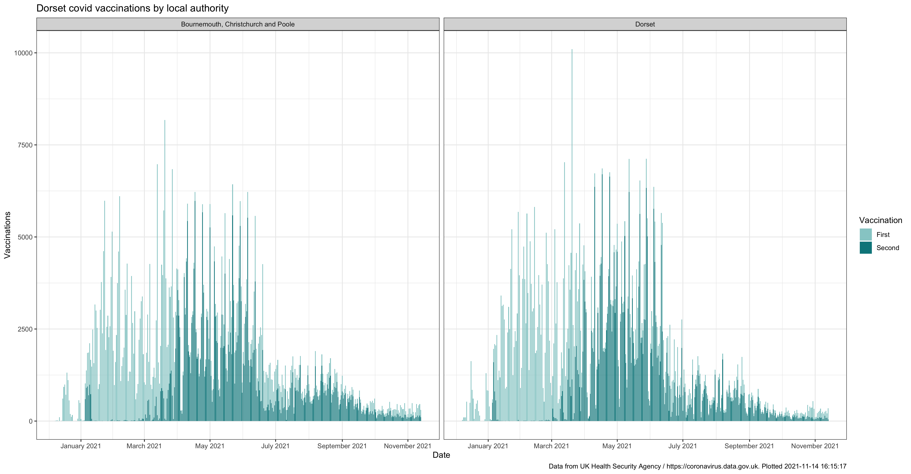
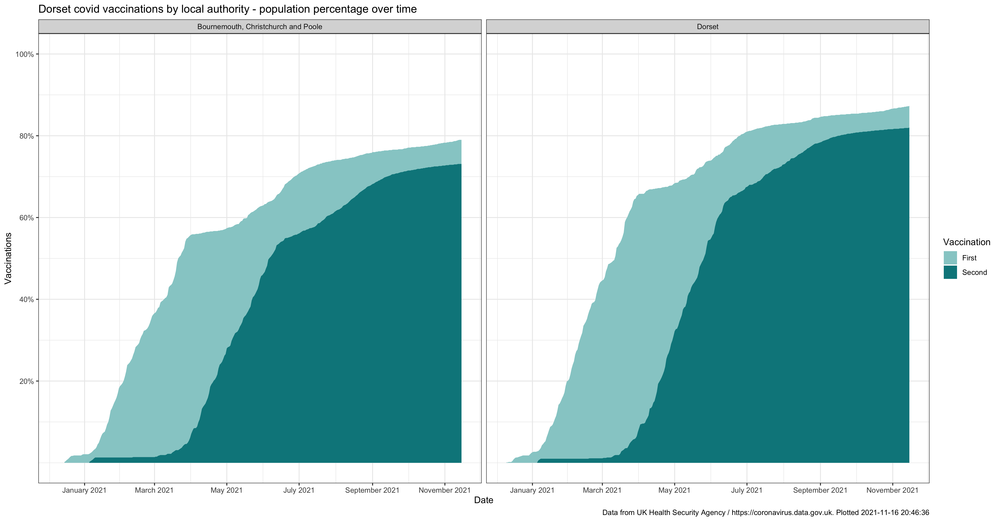
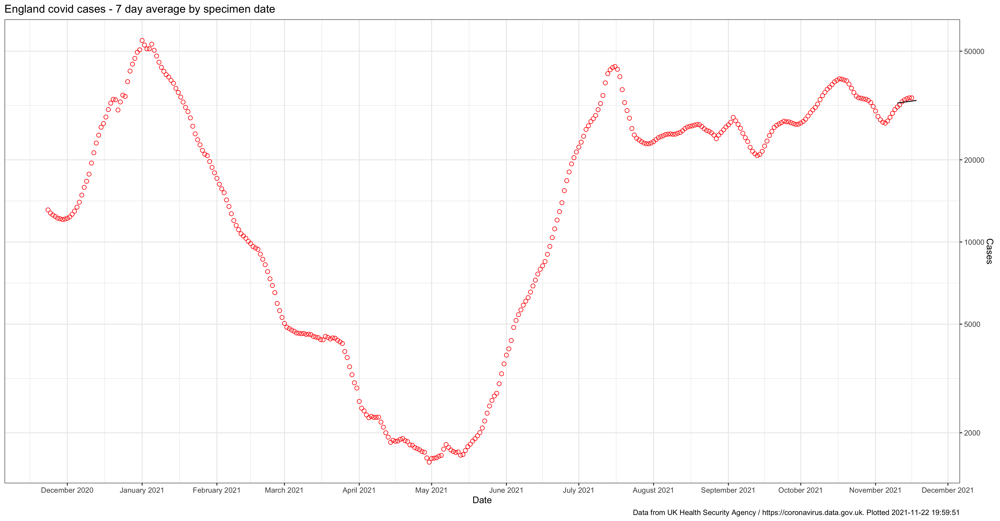
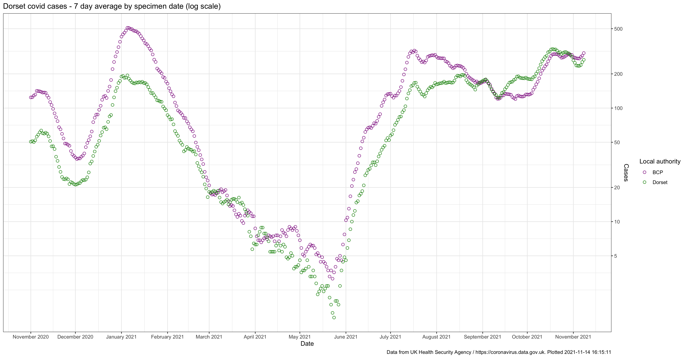
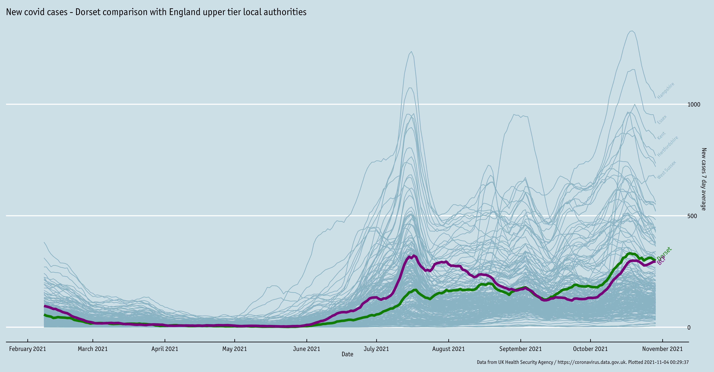
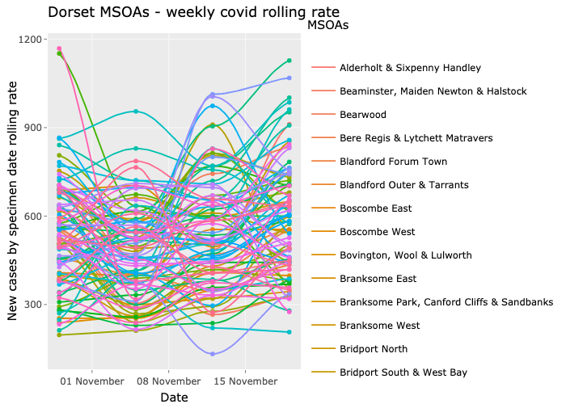
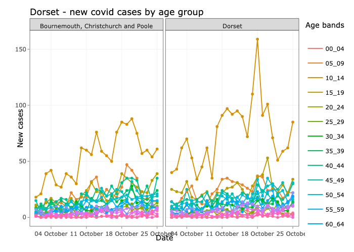
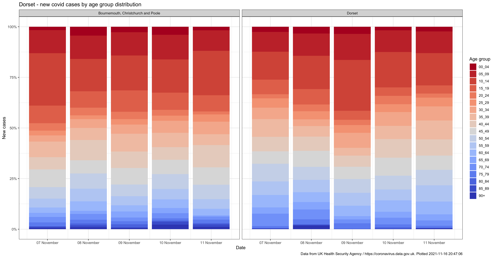
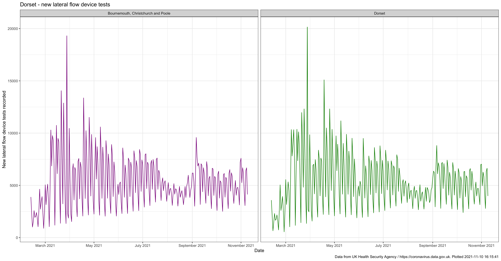
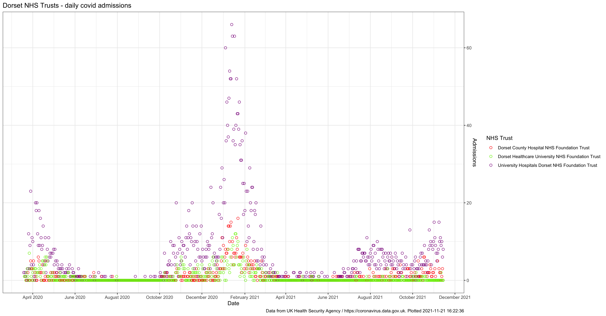

Data plots last updated: 2021-11-04

# Andrew's Dorset and BCP covid statistics

This is the output of me playing around with the [R statistical programming language](https://rafalab.github.io/dsbook/getting-started.html) and the coronavirus data produced on a daily basis by the UK Health Security Agency (UKHSA) and published at [https://coronavirus.data.gov.uk](https://coronavirus.data.gov.uk), focusing on the local authority areas of [Dorset](https://www.dorsetcouncil.gov.uk/) and [Bournemouth, Christchurch and Poole](https://www.bcpcouncil.gov.uk/).

I'm publishing these interpretations of data already in the public domain purely for my personal interest. They're updated when I feel like it, and you should always check the dates on the data plots to see how old they are. To see the most up-to date information you should always check UKHSA's dashboard at [https://coronavirus.data.gov.uk](https://coronavirus.data.gov.uk). I am not a statistician or an epidemiologist, or any kind of expert in this field. **This information is offered on a best endeavours basis for your own interest and you should not use it for any other purpose.**

For authoritative information regarding the prevalence of covid-19 in Dorset or BCP you should visit the website of [Public Health Dorset](https://www.publichealthdorset.org.uk/).

If you find these statistics of interest you may also enjoy my blog posts on [generating the R code behind the England case rates plot](https://www.ajharrison.org.uk/2021/05/03/interpreting-covid-case-rates-with-r/), and the [importance of working with 'long data' as opposed to 'wide data'](https://www.ajharrison.org.uk/2021/05/22/converting-wide-data-into-long-with-r/). You can also look at the underlying R source code at [https://github.com/aharriso11/dorset_covid](https://github.com/aharriso11/dorset_covid).

To see what's changed on these pages visit the [change log](CHANGELOG.md)

You can see a larger version of each data plot by clicking on it.

## Dorset daily vaccinations
Booster or third vaccination data are not yet published to local authority level, to see national level data plots that show these [visit the relevant page of the PHE covid dashboard](https://coronavirus.data.gov.uk/details/vaccinations?areaType=nation&areaName=England).

## Dorset daily vaccinations as percentage of population
Booster or third vaccination data are not yet published to local authority level, to see national level data plots that show these [visit the relevant page of the UKHSA covid dashboard](https://coronavirus.data.gov.uk/details/vaccinations?areaType=nation&areaName=England).

## England daily cases

## Dorset daily cases

## Dorset daily case comparison with other upper tier local authorities
This chart also shows the top five upper tier local authorities

## Dorset MSOA rolling rates
A dynamic data plot showing the MSOA rolling rates can be seen on a [separate web page](msoa_cases.html).

## Dorset new cases by age
A dynamic data plot showing the new cases broken down by age can be seen [on a separate web page](age_cases.html).

### New cases by age distribution

## Dorset daily lateral flow device tests recorded
This chart shows the number of lateral flow device tests (both negative and positive) being recorded each day, broken down by local authority. A negative and positive breakdown is not available at local authority level, for more information on testing [visit the relevant page of the UKHSA dashboard](https://coronavirus.data.gov.uk/details/testing)

## Dorset daily hospital admissions
The [NHS England website](https://www.england.nhs.uk/statistics/statistical-work-areas/covid-19-hospital-activity/) provides much greater detail on hospital admissions than either this website or the UKHSA dashboard.

