Data plots last updated: 2022-02-13

# Andrew's Dorset and BCP covid statistics

This is the output of me playing around with the [R statistical programming language](https://rafalab.github.io/dsbook/getting-started.html) and the coronavirus data produced on a daily basis by the UK Health Security Agency (UKHSA) and published at [https://coronavirus.data.gov.uk](https://coronavirus.data.gov.uk), focusing on the local authority areas of [Dorset](https://www.dorsetcouncil.gov.uk/) and [Bournemouth, Christchurch and Poole](https://www.bcpcouncil.gov.uk/).

I'm publishing these interpretations of data already in the public domain purely for my personal interest. They're updated when I feel like it, and you should always check the dates on the data plots to see how old they are. To see the most up-to date information you should always check UKHSA's dashboard at [https://coronavirus.data.gov.uk](https://coronavirus.data.gov.uk). I am not a statistician or an epidemiologist, or any kind of expert in this field. **This information is offered on a best endeavours basis for your own interest and you should not use it for any other purpose.**

For authoritative information regarding the prevalence of covid-19 in Dorset or BCP you should visit the website of [Public Health Dorset](https://www.publichealthdorset.org.uk/).

If you find these statistics of interest you may also enjoy my blog posts on [generating the R code behind the England case rates plot](https://www.ajharrison.org.uk/2021/05/03/interpreting-covid-case-rates-with-r/), and the [importance of working with 'long data' as opposed to 'wide data'](https://www.ajharrison.org.uk/2021/05/22/converting-wide-data-into-long-with-r/). You can also look at the underlying R source code at [https://github.com/aharriso11/dorset_covid](https://github.com/aharriso11/dorset_covid).

To see what's changed on these pages visit the [change log](CHANGELOG.md)

You can see a larger version of each data plot by clicking on it.

# International and insights

## Other insights
A selection of other data insights, usually updated on an irregular basis, [can be seen on a separate page](insights.html). Other insights currently include data plots of covid variant prevalence in England, vaccination uptake by age for Dorset, and mobility data from Google for Dorset.

## International comparison
An international comparison of cases and vaccinations per million between the UK and some other countries [is available on a separate page](international.html).

# Vaccinations

## Dorset daily vaccinations

## Dorset vaccination uptake as percentage of population
### Local authority level uptake
[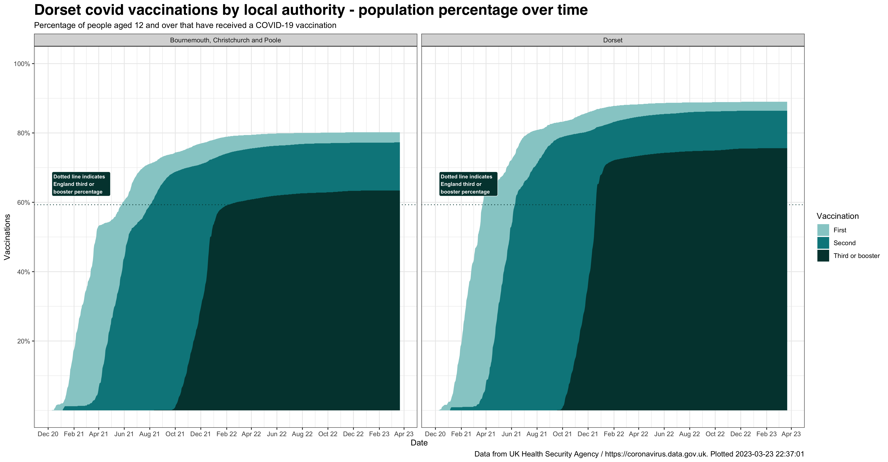](./output/daily_dorset_vaccs_percentage.png?raw=true)

### Breakdown by local authority and age group
[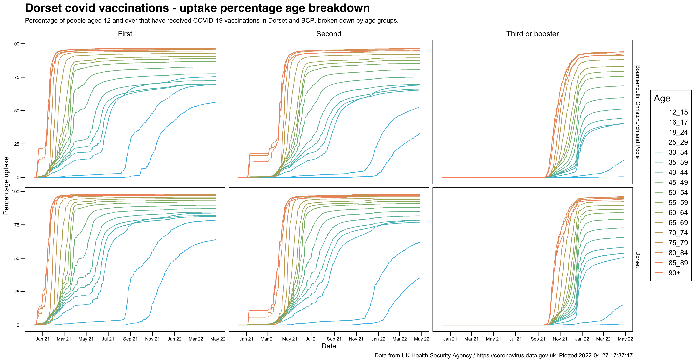](./output/vaccinations_age.png?raw=true)

### Dorset Council - MSOA (medium super output area) uptake
[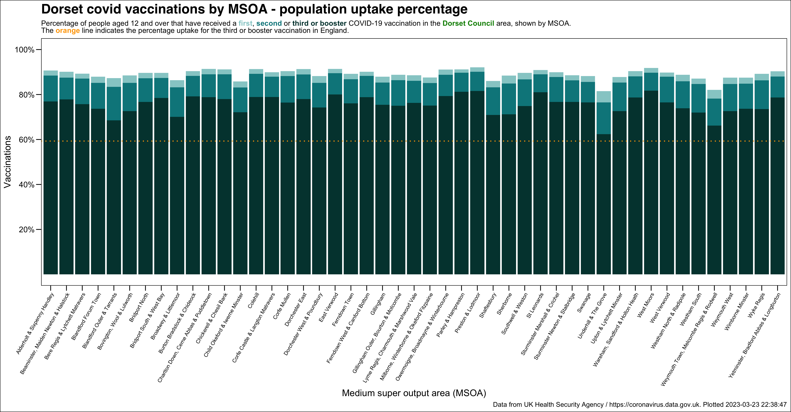](./output/vaccs_percentage_msoa_dorset.png?raw=true)

### BCP Council - MSOA (medium super output area) uptake

# Cases

## England daily cases
[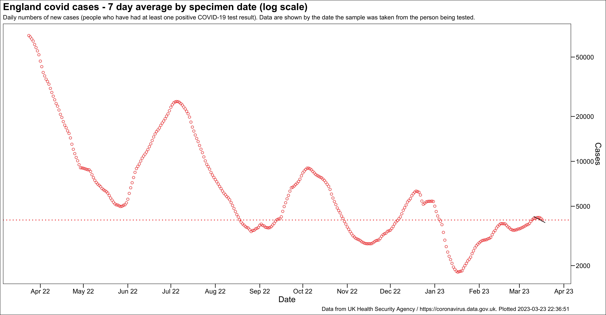](./output/daily_england_cases.png?raw=true)

## England regions daily cases
[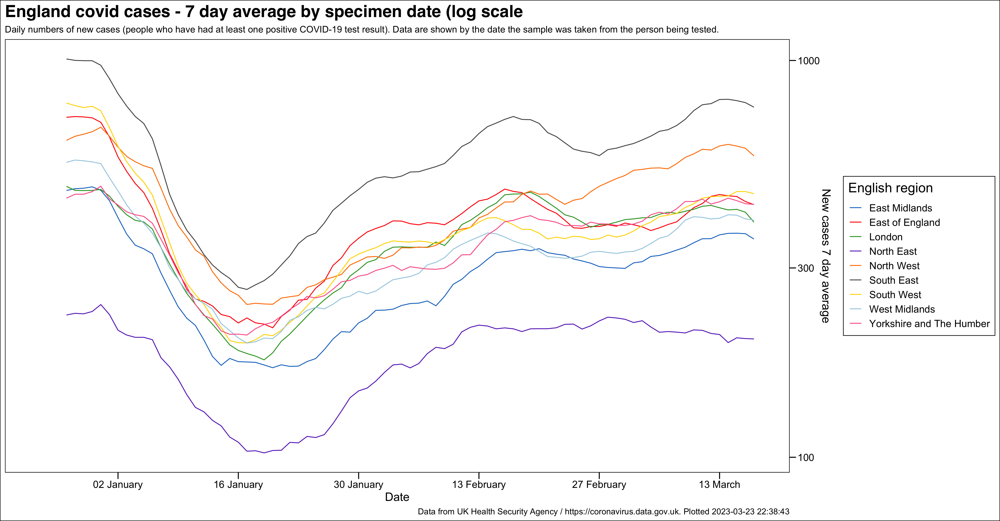](./output/region_cases.png?raw=true)

## Dorset daily cases
[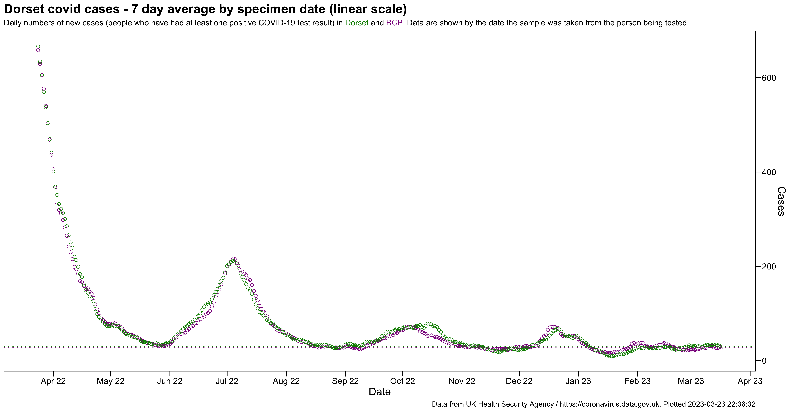](./output/daily_dorset_cases.png?raw=true)

## Daily change in Dorset cases by specimen date
[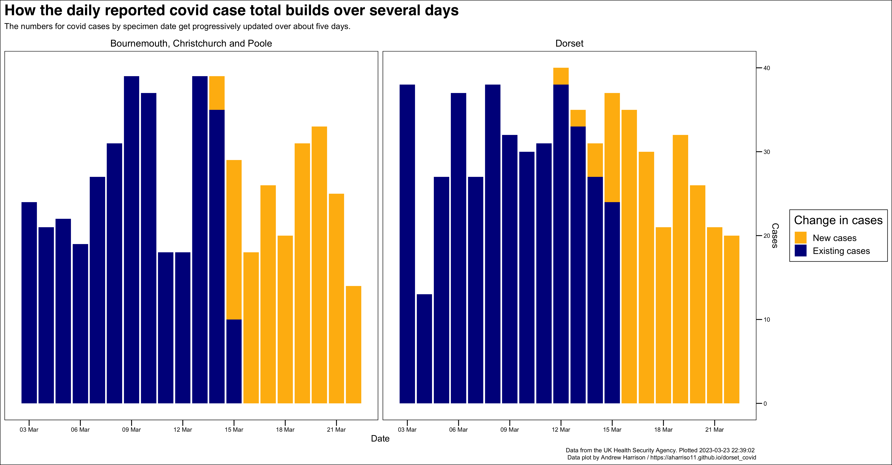](./output/dorset_cases_change.png?raw=true)

## Dorset daily case comparison with other upper tier local authorities
This chart also shows the top five upper tier local authorities
[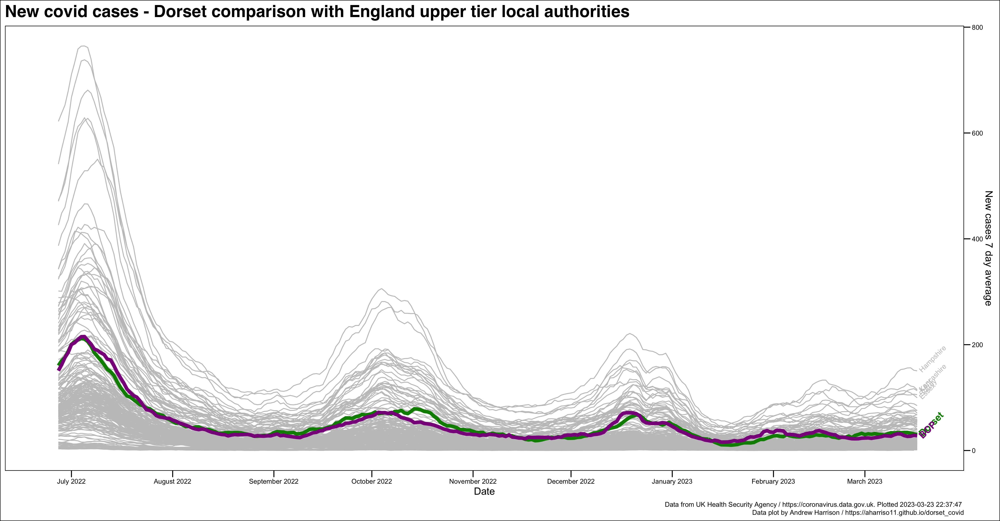](./output/daily_cases_utlas.png?raw=true)

## Dorset daily case comparison with south west lower tier local authorities
This chart also highlights LTLAs most affected by the recent [Immensa PCR testing failure](https://www.standard.co.uk/news/uk/exeter-government-taunton-somerset-nhs-england-b961477.html) in red and is presented on this page as a dynamic data plot. You can also view the dynamic data plot [at full size on a separate page](./output/sw_cases.html), or view a [static version](./output/sw_cases.png?raw=true).
<iframe src="./output/sw_cases.html" title="South west case focus" width=1000 height=700></iframe>

## Dorset MSOA rolling rates
A dynamic data plot showing the MSOA rolling rates which can also be seen [at full size on a separate web page](./output/msoa_cases.html).
<iframe src="./output/msoa_cases.html" title="MSOA case focus" width=1000 height=700></iframe>

## Dorset new cases by age
A dynamic data plot showing the new cases broken down by age which can also be seen [at full size on a separate web page](./output/age_cases.html).
<iframe src="./output/age_cases.html" title="Age case focus" width=1000 height=700></iframe>

### New cases by age distribution
[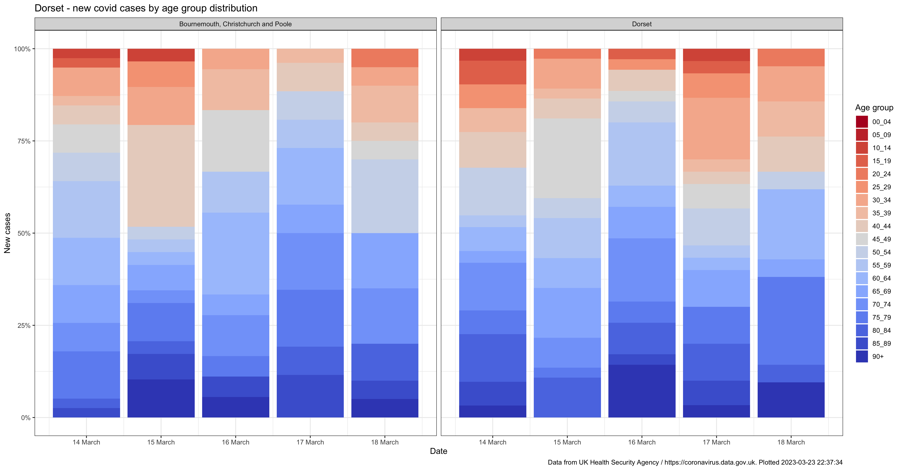](./output/dorset_age_cases_percentage.png?raw=true)

# Testing

## Dorset test positivity comparison with other upper tier local authorities
The metric description of this chart comes from the [newly published metrics documentation](https://coronavirus.data.gov.uk/metrics/doc/uniqueCasePositivityBySpecimenDateRollingSum) on the UKHSA dashboard.
[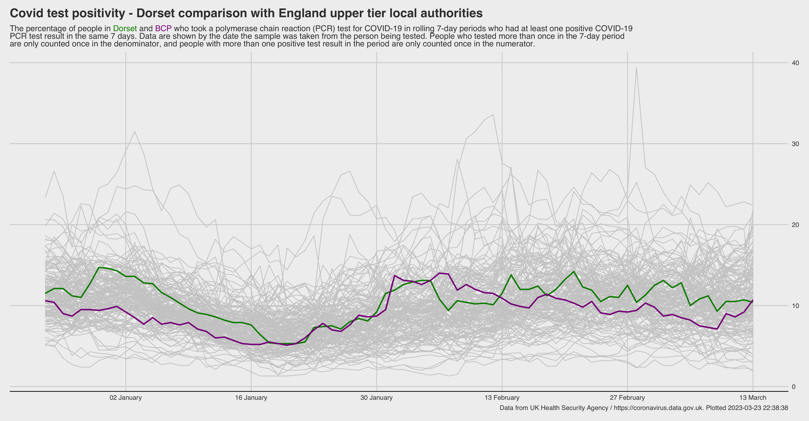](./output/daily_test_positivity.png?raw=true)

## Dorset daily covid tests recorded
This chart shows the number of PCR and lateral flow device tests (both negative and positive) being recorded each day, broken down by local authority. A negative and positive breakdown is not available at local authority level, for more information on testing [visit the relevant page of the UKHSA dashboard](https://coronavirus.data.gov.uk/details/testing)
[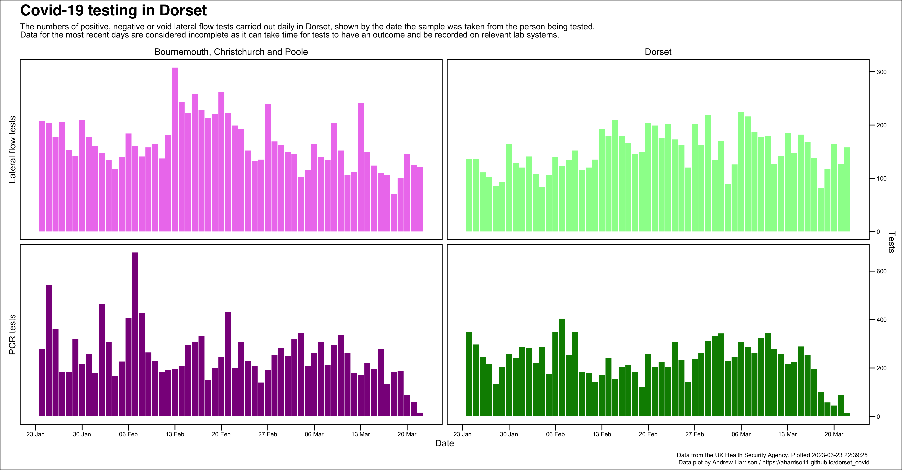](./output/dorset_testing.png?raw=true)

# Hospital activity

## Hospital activity phase portrait
This chart compares new covid-19 admissions with the number of cases in hospital.
[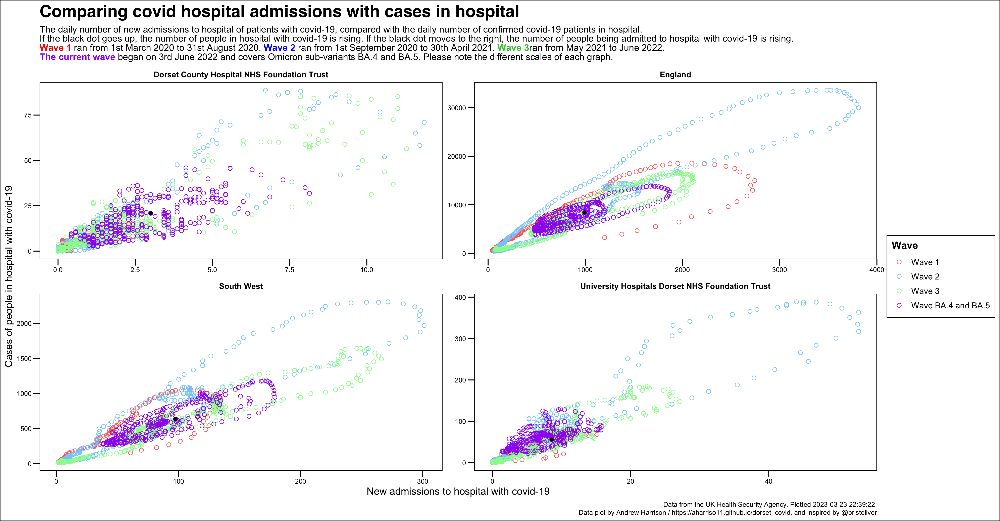](./output/hosp_phase.png?raw=true)

## Dorset daily hospital admissions
See [NHS trust level data for hospital admissions, bed occupancy and deaths](hospital_activity.MD).

The [NHS England website](https://www.england.nhs.uk/statistics/statistical-work-areas/covid-19-hospital-activity/) provides much greater detail on hospital admissions than either this website or the UKHSA dashboard. 
[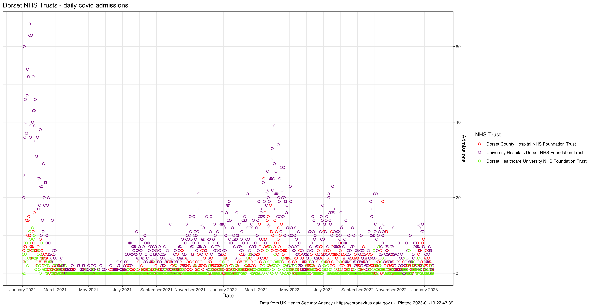](./output/daily_dorset_admissions.png?raw=true)
