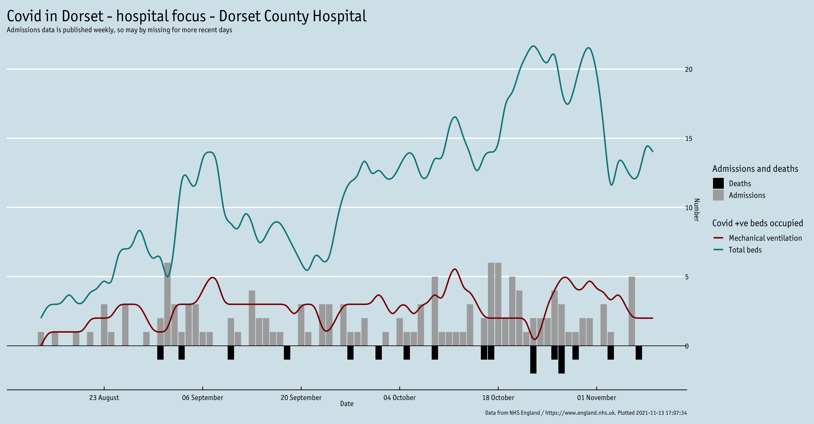
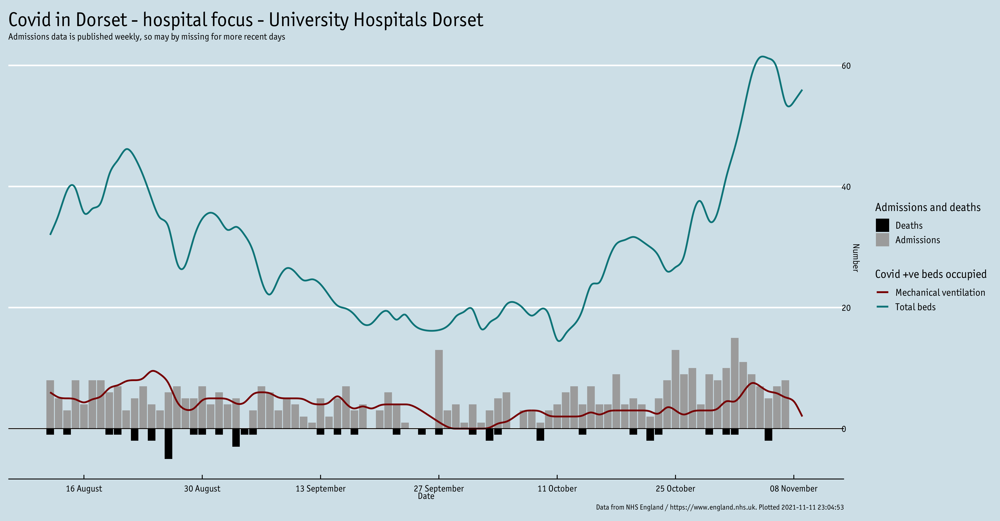

# Hospital activity and deaths

These data plots show:
 - Admissions to hospital and diagnoses in hospital for covid-19 (grey bars)
 - Total beds occupied by covid-19 patients (purple line)
 - Total mechanical ventilation beds occupied by covid-19 patients (red line)
 - Deaths in hospital with covid-19 (black bars)
 
 The data are taken from NHS England's covid-19 [weekly hospital activity](https://www.england.nhs.uk/statistics/statistical-work-areas/covid-19-hospital-activity/) and [daily deaths](https://www.england.nhs.uk/statistics/statistical-work-areas/covid-19-daily-deaths/) publications. Due to the weekly publication of the hospital activity data on Thursdays, the plots are updated weekly.
 
## Dorset County Hospital
 

 
## University Hospitals Dorset
 
