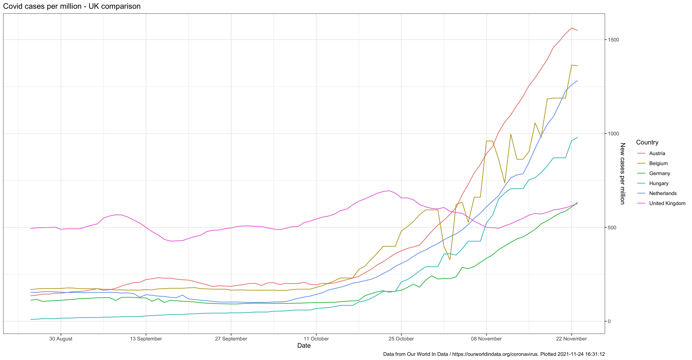
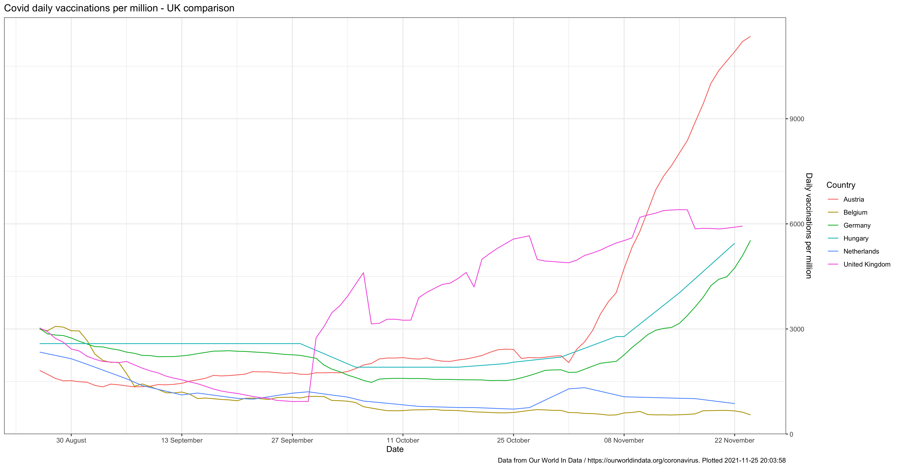

# International comparison

These data plots show comparisons in daily cases and vaccinations per million for the following countries:
 - UK
 - Austria
 - Belgium
 - Germany
 - Hungary
 - Netherlands
 
 The data are taken from Our World In Data's [daily covid dataset](https://github.com/owid/covid-19-data/tree/master/public/data) and [daily vaccinations dataset](https://github.com/owid/covid-19-data/tree/master/public/data/vaccinations) publications. **Please note that the scale of each data plot may well be different.**
 
## Daily cases per million
 

 
## Daily vaccinations per milliom
 
